# Problem 1

## Part A

Overall, we notice an oscillatory pattern in the plot of preds vs prey, where they are anti-polar, meaning as one
decreases, the other increases. In terms of spatial pattern, the preds appear to be chasing the prey in an almost
circular motion, typically counter-clockwise. My model differs from Sayama's because whereas theirs converges to a
stable distribution with both preds and prey, typically the preds die out in the stable solution for my model. Not in
this specific parameterization, but I have noticed in future answers there are definitely instances where both
populations die out.

```{python}
#| eval: false

# Imports

from pyDOE import lhs
from statistics import median
import copy as cp
import numpy.matlib as npm
import seaborn as sns
import numpy as np
import random
import matplotlib.pyplot as plt
import matplotlib
from IPython import display
import time

%matplotlib inline


# Parameters

nr = 500. # carrying capacity of rabbits ***

r_init = 100 # initial rabbit population
mr = 0.03 # magnitude of movement of rabbits
dr = 1.0 # death rate of rabbits when it faces foxes ***
rr = 0.1 # reproduction rate of rabbits

f_init = 30 # initial fox population
mf = 0.05 # magnitude of movement of foxes
df = 0.1 # death rate of foxes when there is no food ***
rf = 0.5 # reproduction rate of foxes ***

cd = 0.02 # radius for collision detection
cdsq = cd ** 2


# Model Functions

class agent:
    pass

def initialize():
    global agents, rdata, fdata
    agents = []
    rdata = []
    fdata = []
    for i in range(r_init + f_init):
        ag = agent()
        ag.type = 'r' if i < r_init else 'f'
        ag.x = random.random()
        ag.y = random.random()
        agents.append(ag)

def observe():
    global agents, rdata, fdata

    plt.subplot(2, 1, 1)
    plt.cla()
    rabbits = [ag for ag in agents if ag.type == 'r']
    if len(rabbits) > 0:
        x = [ag.x for ag in rabbits]
        y = [ag.y for ag in rabbits]
        plt.plot(x, y, 'b.')
    foxes = [ag for ag in agents if ag.type == 'f']
    if len(foxes) > 0:
        x = [ag.x for ag in foxes]
        y = [ag.y for ag in foxes]
        plt.plot(x, y, 'ro')
    plt.axis('image')
    plt.axis([0, 1, 0, 1])

    plt.subplot(2, 1, 2)
    plt.cla()
    plt.xlim(0, 300)
    plt.plot(rdata, label = 'prey')
    plt.plot(fdata, label = 'predator')
    plt.legend()
    plt.show()

def update():
    global agents, rdata, fdata
    t = 0.
    while t < 1. and len(agents) > 0:
        t += 1. / len(agents)
        update_one_agent()

    rdata.append(sum([1 for x in agents if x.type == 'r']))
    fdata.append(sum([1 for x in agents if x.type == 'f']))

def update_one_agent():
    global agents
    if agents == []:
        return

    ag = random.choice(agents)

    # simulating random movement
    m = mr if ag.type == 'r' else mf
    ag.x += random.uniform(-m, m)
    ag.y += random.uniform(-m, m)
    ag.x = 1 if ag.x > 1 else 0 if ag.x < 0 else ag.x
    ag.y = 1 if ag.y > 1 else 0 if ag.y < 0 else ag.y

    # detecting collision and simulating death or birth
    neighbors = [nb for nb in agents if nb.type != ag.type
                 and (ag.x - nb.x)**2 + (ag.y - nb.y)**2 < cdsq]

    if ag.type == 'r':
        if len(neighbors) > 0: # if there are foxes nearby
            if random.random() < dr:
                agents.remove(ag)
                return
        if random.random() < rr*(1-sum([1 for x in agents if x.type == 'r'])/nr):
            agents.append(cp.copy(ag))
    else:
        if len(neighbors) == 0: # if there are no rabbits nearby
            if random.random() < df:
                agents.remove(ag)
                return
        else: # if there are rabbits nearby
            if random.random() < rf:
                agents.append(cp.copy(ag))
```

To see the code that generated these gifs for A and B, look at <i>'prob_1_sims.py'</i>!

::: {layout-ncol=2}
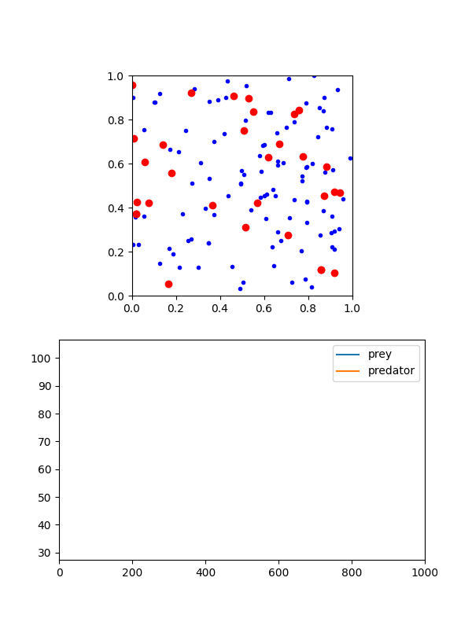{width="200%"}
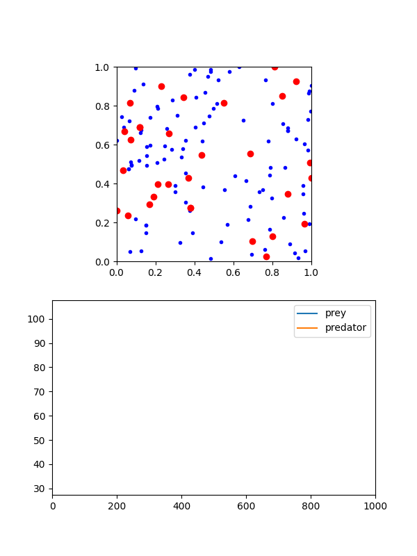{width="100%"}
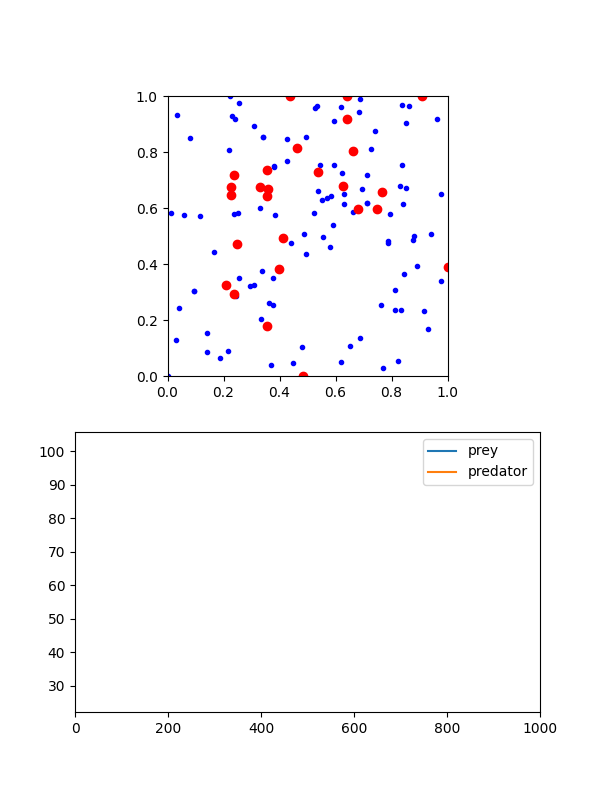{width="100%"}
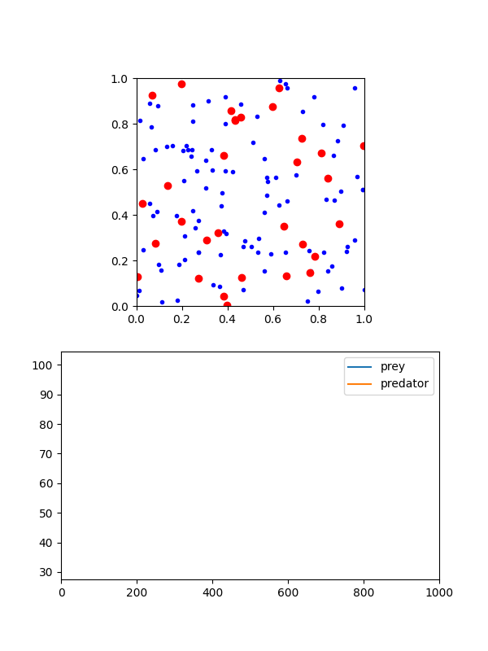{width="100%"}
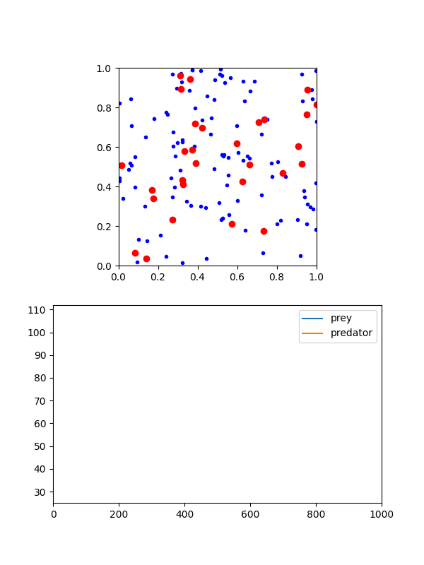{width="100%"}

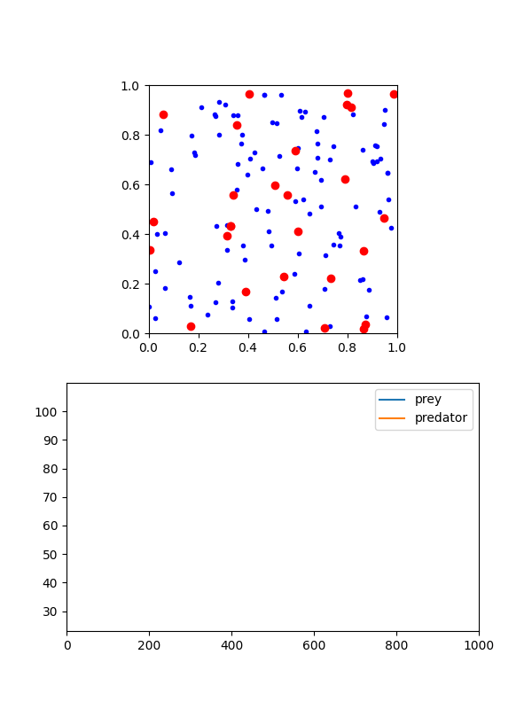{width="100%"}
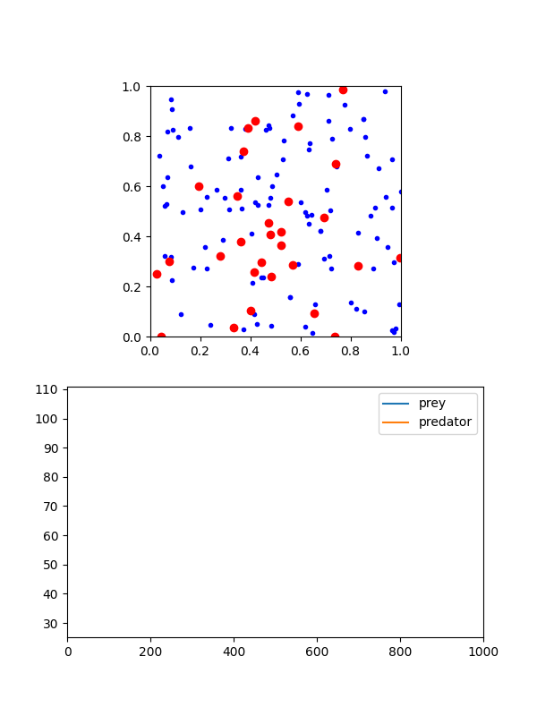{width="100%"}
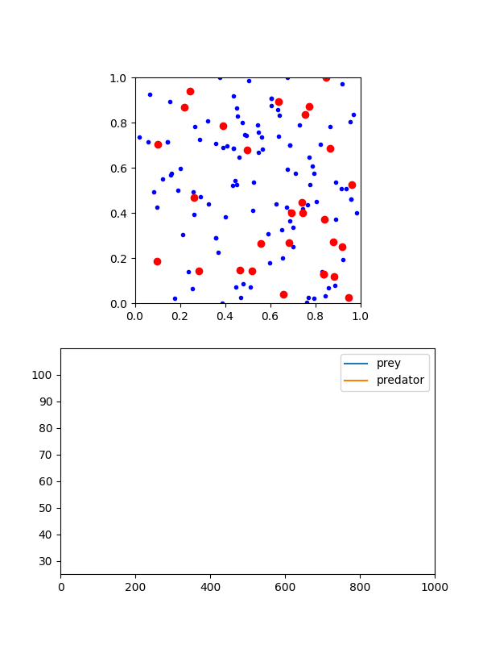{width="100%"}
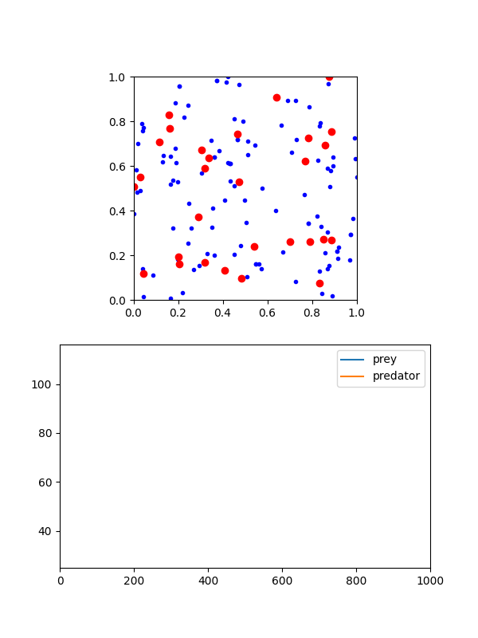{width="100%"}
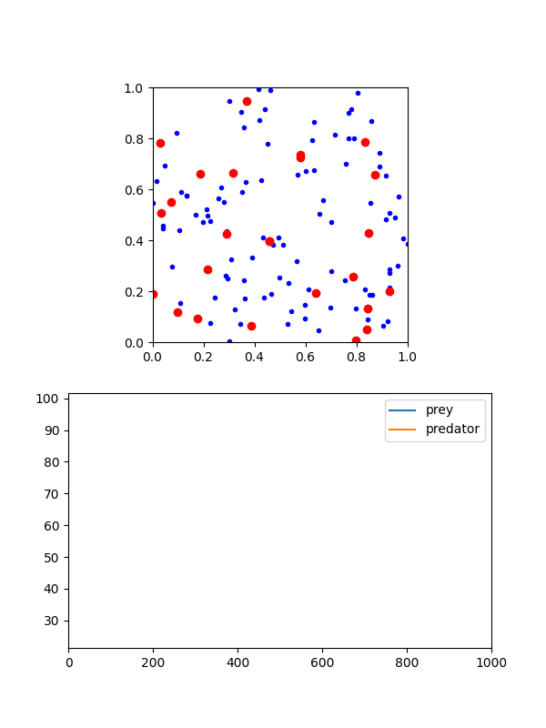{width="100%"}
:::


## Part B

Again, to see the code, check <i>'prob_1_sims.py'</i>

We notice that there is some decent variability in the models in terms of paths, but the overall variance of the totals
remains the same. In time series, I would argue the covariance is stationary, though the mean may not be. Thus, the
process might be weak-sense stationary depending on the definition you use (AKA the mean condition). Generally, the
prey populations experience much larger fluctuations than the pred populations, although eventually the preds often die
out. I would be interested in testing the Borel-Cantelli Lemma to see if they will always die out (I think that's the
correct Lemma)


## Part C

To see this code, check <i>'prob_1_fig_c.py'</i>!

```{python}
#| eval: false

nrs = [200., 300., 400., 500., 600., 700., 800.]
sim_pred_means = []
sim_prey_means = []

# Insert the rest of the parameters and functions

def run_single_simulation(nr_val):
    global nr
    nr = nr_val

    initialize()
    for _ in range(400):
        update()

    return rdata[-1], fdata[-1]

if __name__ == '__main__':

    with mp.Pool(processes=4) as pool:
        for _nr in nrs:
            results = pool.map(run_single_simulation, [_nr] * 5)
            prey_vals = [res[0] for res in results]
            pred_vals = [res[1] for res in results]

            sim_prey_means.append(np.mean(prey_vals))
            sim_pred_means.append(np.mean(pred_vals))

    beta_pred, a_pred = np.polyfit(nrs, sim_pred_means, 1)
    beta_prey, a_prey = np.polyfit(nrs, sim_prey_means, 1)

    plt.scatter(nrs, sim_pred_means, color = 'orange', label='Predator Averages')
    plt.scatter(nrs, sim_prey_means, color = 'blue', label='Prey Averages')
    plt.plot(nrs, beta_pred * np.array(nrs) + a_pred, color = 'orange', label='Predator LSRL')
    plt.plot(nrs, beta_prey * np.array(nrs) + a_prey, color = 'blue', label='Prey LSRL')
    plt.xlabel('NR')
    plt.ylabel('Mean Final Agents')
    plt.legend()
    plt.savefig('images/nr_LSRL.png', dpi=300)
```

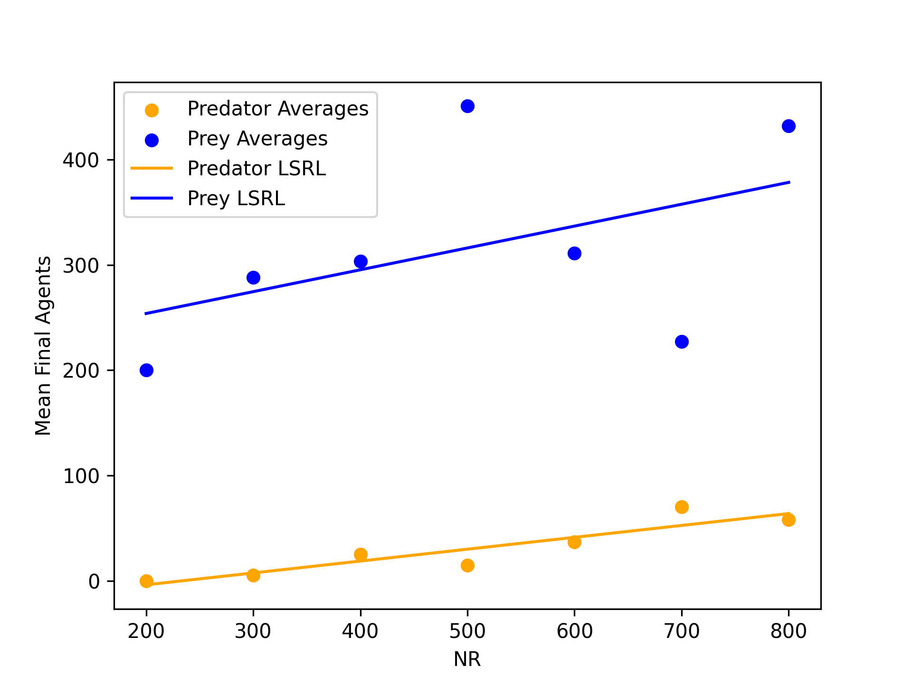

The main pattern that I notice in the first plot is that the pred/pray mean distribution appears to remain consistent
in terms of proportions, at least in terms of the LSRLs. Secondly, there appears to be less stability as NR increases in
the prey populations, suggesting heteroskedasticity and a variance that asymptotically goes to infinity in the sample
means. To address this and see how fragile the pred population is, since the variability barely changes, I ran a sweep of
df down below. The results show that the sensitivity of the pred population primarily comes from their chances of
survival rather than the abundance orf resources, suggesting more resilient populations are more likely to survive.

To see the code for the second figure, check <i>'prob_1_fig_c_2.py'</i>!

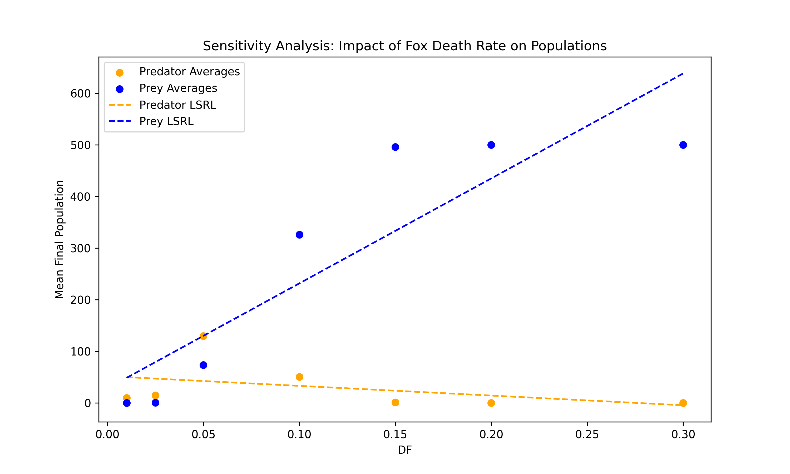

## Part D and E

<b>Please see the code in the folder for the image generations (prob_1d_sim.py)</b>

For the histograms, there are a lot of zeroes in both, but the pred population appears to be much more fragile than the
prey population. This makes sense, since the pred population will eventually die out if there is no more prey. The
scatterplot seems to support this notion. Generally, the pred population is much more sensitive and smaller than the
prey population, and there are many instances where all of the preds die out. It is very uncommon that we see the preds
outnumber the prey, and when they do it is likely that as time goes on they will swing back to being the minority.

As for the scatterplots, generally I notice the following:

* As df increases, eventually the prey never die out and the preds always die out
* nr surprisingly doesn't always lead to more predators, which feels somewhat paradoxical
* dr is incredibly noisy
* rf is also surprisingly noisy

And as for my heatmap, I plotter rf and dr against final pred pop. Generally, the final pred pop is quite low, like we
have generally noticed, but there are some potential hotspots. Though many of these hot spots are likely noise. I think
the primary issue lies in the fact that we are taking the final output of a oscillatory model, which is almost a gamble.
Instead, we should take the average over the final stretch, say 100 steps, of the model runs, as that should smooth out
much of the noise.

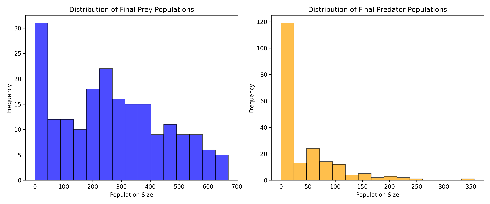

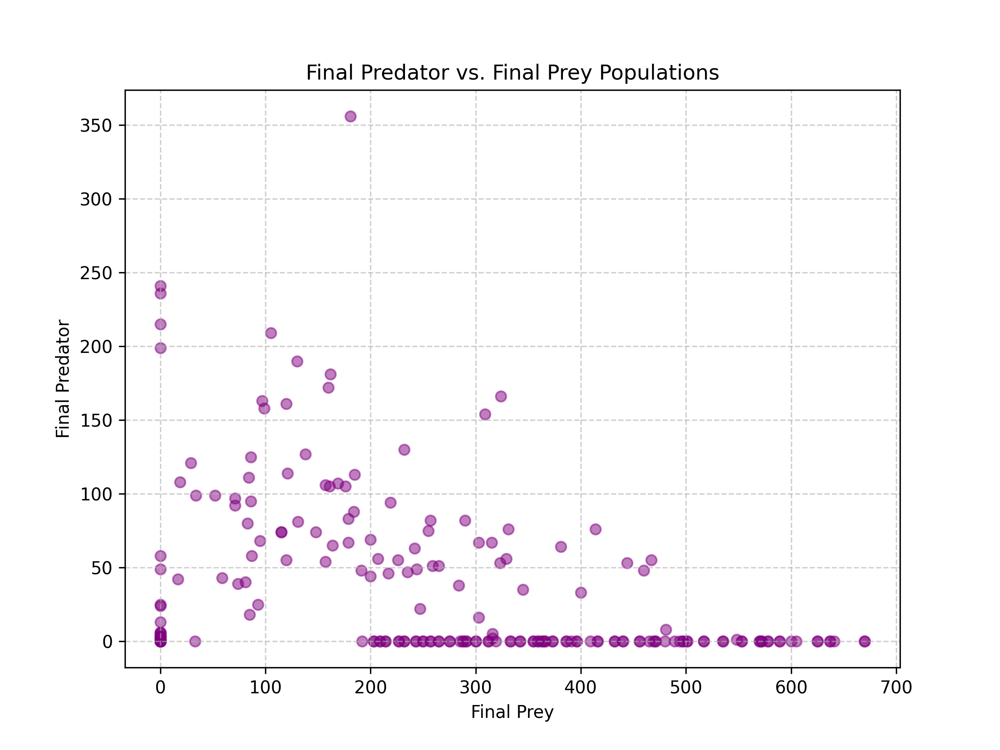

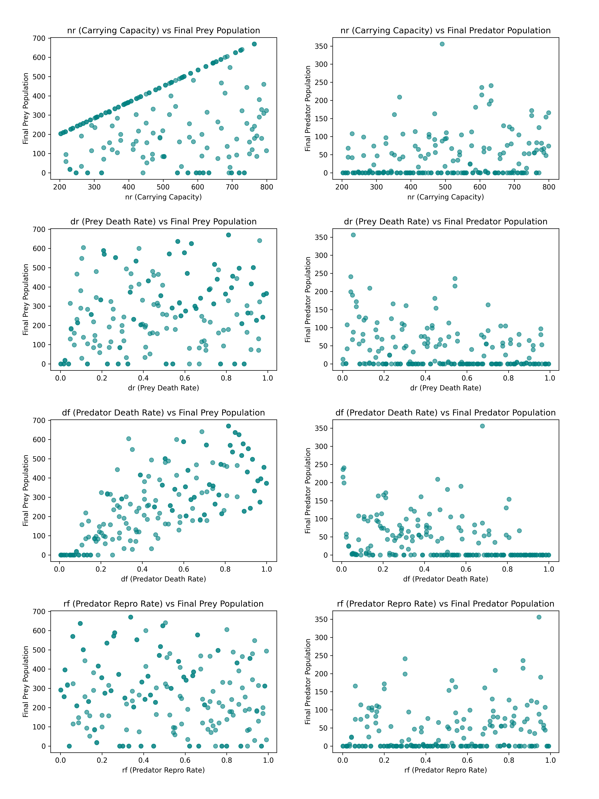

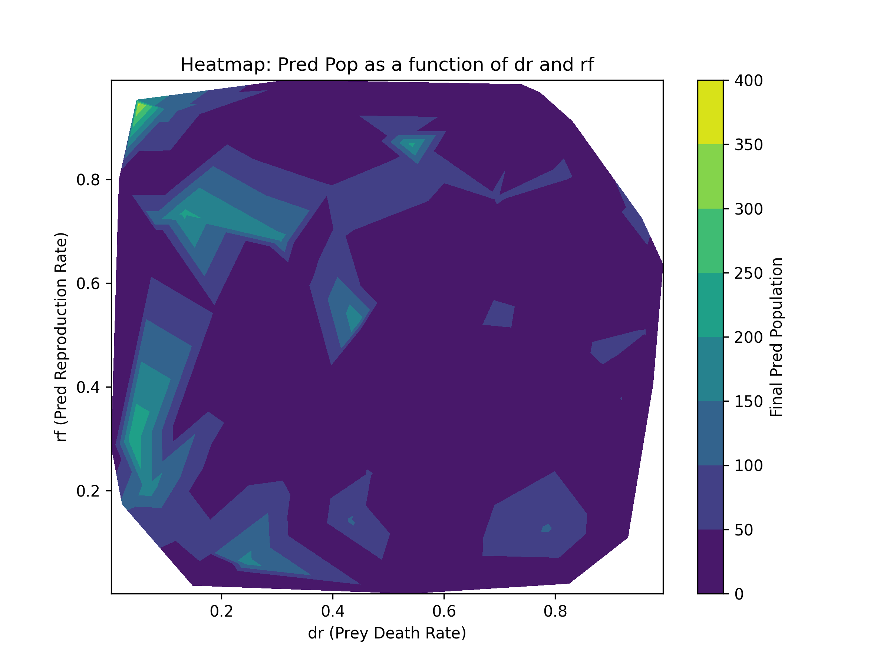